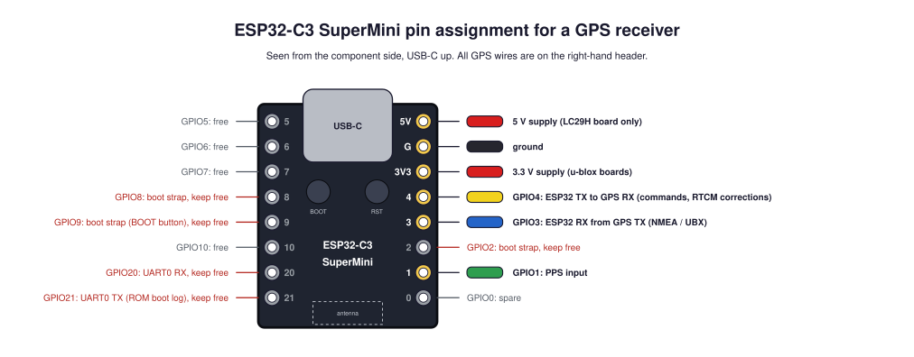
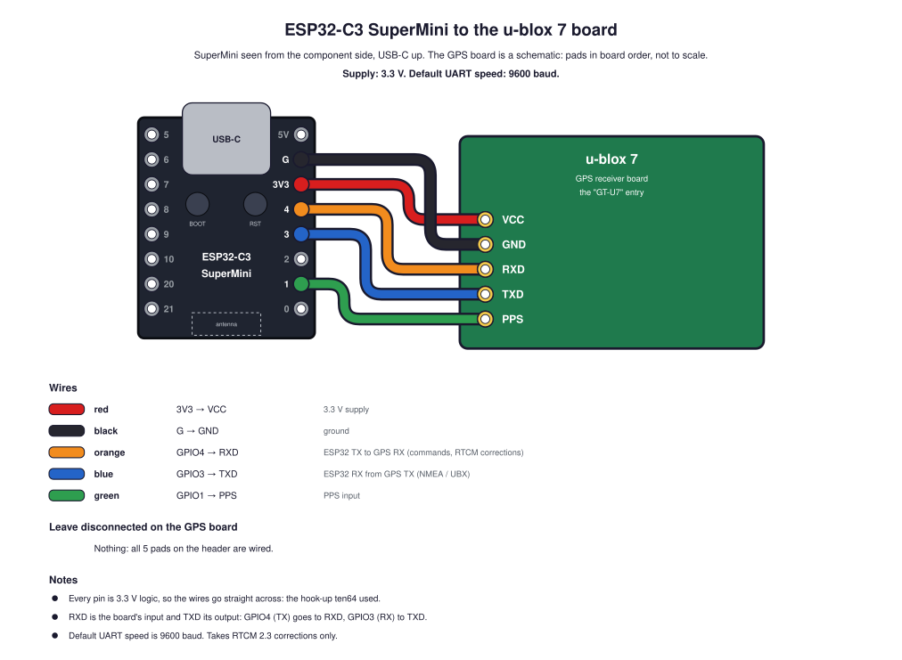
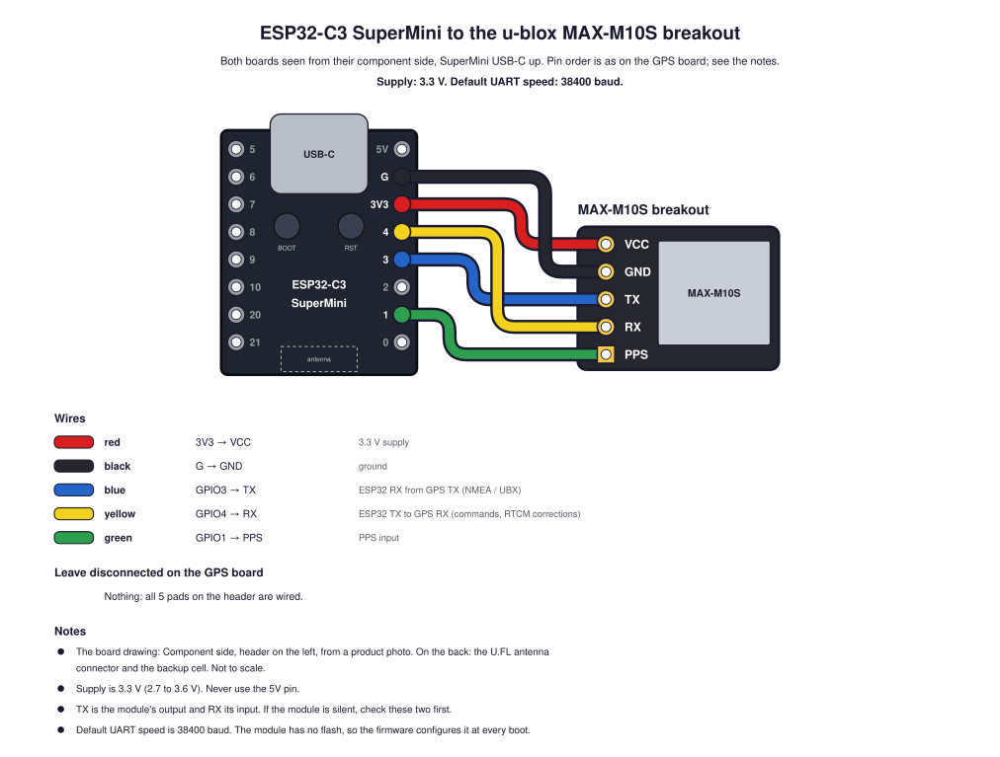
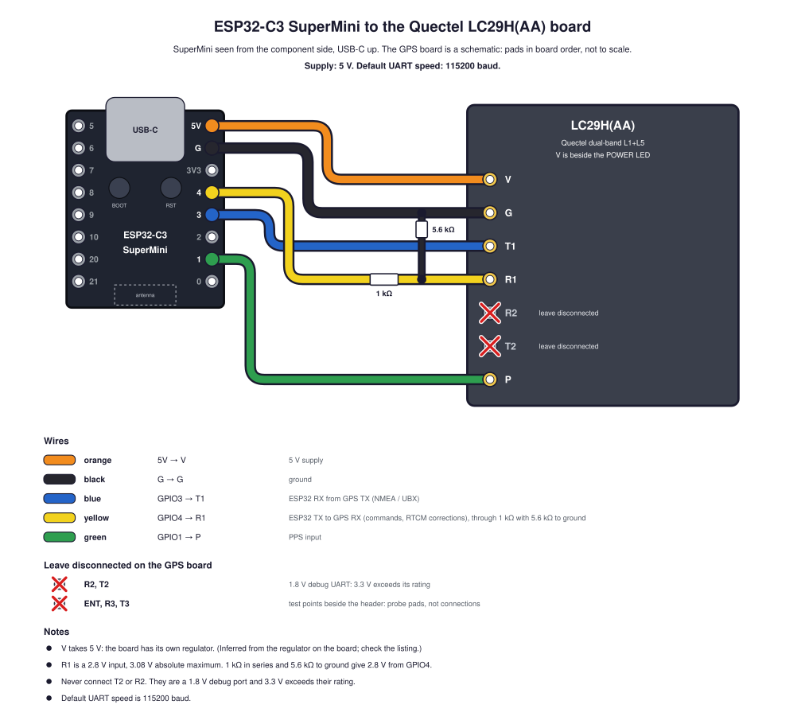
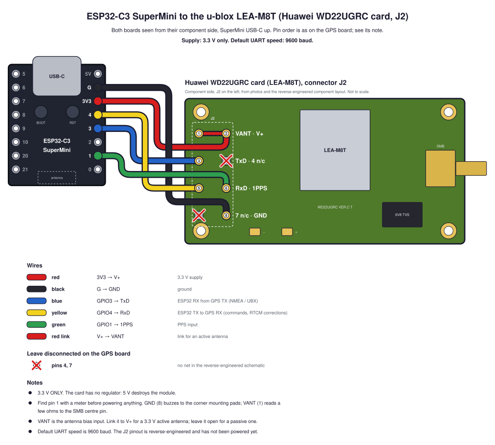

# Wiring an ESP32-C3 SuperMini to a GPS receiver

Every supported receiver uses the same three signal pins on the SuperMini.
Only the supply pin and the pad names on the receiver change.

> [!WARNING]
> None of this wiring has been tested on an ESP32 yet. The pad orders and
> voltages come from bench notes made while these receivers were wired to a
> Ten64 and to Raspberry Pis. See [Where this comes from](#where-this-comes-from).

## Pin assignment



| SuperMini pin | Wire | Role |
|---|---|---|
| 5V | orange | 5 V supply, LC29H board only |
| G | black | ground |
| 3V3 | red | 3.3 V supply, u-blox boards |
| GPIO4 | yellow | ESP32 TX to GPS RX: commands and RTCM corrections |
| GPIO3 | blue | ESP32 RX from GPS TX: NMEA and UBX |
| GPIO1 | green | PPS input |

Everything is on the right-hand header, so one 8-way connector carries the
supply and all the signals.

Pins kept free:

* **GPIO2, GPIO8, GPIO9** are boot straps. A receiver holding one of them at
  the wrong level at reset stops the ESP32 booting.
* **GPIO20, GPIO21** are UART0. The ROM prints its boot log on GPIO21 at
  reset, which would otherwise be sent into the receiver's RX pin.

The UART is always crossed: the ESP32's TX (GPIO4) goes to the receiver's RX
pad, and the receiver's TX pad goes to the ESP32's RX (GPIO3).

## Reading the wire tables

Each receiver below has one table listing **every** pad on its header, in
the order the pads have on the board. A pad is either wired to a SuperMini
pin or marked **leave disconnected**, with what the pad is and why. Those
pads are crossed out in red on the diagram.

`scripts/gps_modules.py` holds the same record and refuses to load a
receiver that has a pad neither wired nor marked as disconnected.

## At a glance

| Receiver | Supply pin | Default baud | Level shifting | Corrections it accepts |
|---|---|---|---|---|
| [u-blox 7 board](#u-blox-7-board) | 3V3 | 9600 | none | RTCM 2.3 |
| [MAX-M10S breakout](#u-blox-max-m10s-breakout) | 3V3 | 38400 | none | RTCM 3 (not yet seen working) |
| [LC29H(AA) board](#quectel-lc29haa-board) | **5V** | 115200 | divider on GPIO4 | untested |
| [LEA-M8T on WD22UGRC](#u-blox-lea-m8t-on-the-huawei-wd22ugrc-card) | **3V3 only** | 9600 | none | untested |

## u-blox 7 board

This is the receiver the project calls "GT-U7": the u-blox 7 board that ran
on ten64 until 2026-09-06.



| Board pad | What the pad is | Wire | Connect to |
|---|---|---|---|
| PPS | one pulse per second | green | GPIO1 |
| TXD | serial output: NMEA and UBX | blue | GPIO3 |
| RXD | serial input: commands and RTCM corrections | yellow | GPIO4 |
| GND | ground | black | G |
| VCC | supply input, 3.3 V | red | 3V3 |

All five pads are wired. None is left disconnected.

* Every pin is 3.3 V logic, so no level shifting.
* Seen from above the header pins, the order is PPS, TXD, RXD, GND, VCC:
  green, blue, yellow, black, red.
* It accepts RTCM 2.3 corrections only.

## u-blox MAX-M10S breakout



| Board pad | What the pad is | Wire | Connect to |
|---|---|---|---|
| V | supply input, 3.3 V | red | 3V3 |
| G | ground | black | G |
| T | serial output (the module's TX): NMEA and UBX | blue | GPIO3 |
| R | serial input (the module's RX): commands and RTCM corrections | yellow | GPIO4 |
| P | one pulse per second | green | GPIO1 |

All five pads are wired. None is left disconnected.

* Supply is 3.3 V (2.7 to 3.6 V). Never use the 5V pin.
* T is the module's output and R its input. If the module is silent, check
  these two wires first.
* The module has no flash. The firmware has to send its configuration at
  every boot.

## Quectel LC29H(AA) board



| Board pad | What the pad is | Wire | Connect to |
|---|---|---|---|
| P | one pulse per second, rising edge | green | GPIO1 |
| T2 | UART2 output: the same debug port as R2, 3 000 000 baud by default. 1.8 V logic. | none | **leave disconnected**: debug output only, and 1.8 V is below the ESP32's 2.48 V input-high threshold |
| R2 | UART2 input. UART2 is a second serial port that carries system debugging data only. 1.8 V logic, 1.98 V absolute maximum. | none | **leave disconnected**: the ESP32's 3.3 V exceeds its rating, and nothing the firmware needs is on UART2 |
| R1 | UART1 input: commands and RTCM corrections. 2.8 V logic, 3.08 V absolute maximum. | yellow | GPIO4, through the divider |
| T1 | UART1 output: NMEA, RTCM and PQTM. 2.8 V logic. | blue | GPIO3 |
| G | ground | black | G |
| V | supply input to the board's own regulator, 5 V | orange | 5V |
| ENT | test point beside the header, not on it. What it carries has not been identified. | none | **leave disconnected**: a probe pad, not a connection |
| R3, T3 | test points beside the header, not on it. Not a third serial port: the LC29H has only two UARTs. What they carry has not been identified. | none | **leave disconnected**: probe pads, not connections |

* **V takes 5 V.** The board has its own regulator. This was inferred from
  the regulator next to the POWER LED, not read from a datasheet, so check
  your board's listing before powering it.
* **R1 needs a divider.** UART1 is a 2.8 V domain with a 3.08 V absolute
  maximum, and the ESP32 drives 3.3 V. Put 1 kΩ in series with GPIO4 and
  5.6 kΩ from the R1 side of it to ground: 3.3 V × 5.6 / 6.6 = 2.8 V.
* T1 needs nothing. Its 2.8 V output is above the ESP32-C3's input-high
  threshold of 0.75 × 3.3 V = 2.48 V.
* With the header on the left, as in the diagram, the silkscreen reads
  P, T2, R2, R1, T1, G, V from the top: P is the end beside the PPS LED and
  ENT / R3 / T3, V the end beside the POWER LED and the regulator. The
  diagram's layout follows a photo of the board.

## u-blox LEA-M8T on the Huawei WD22UGRC card



| J2 pin | What the pin is | Wire | Connect to |
|---|---|---|---|
| 1, VANT | antenna bias input: the supply the card passes up the antenna cable to power an active antenna. The card does not generate it. | red link | J2 pin 2 (V+) for a 3.3 V active antenna. **Leave disconnected** for a passive antenna. |
| 2, V+ | supply input, fed straight to the module: 3.3 V only | red | 3V3 |
| 3, TxD | serial output: NMEA and UBX | blue | GPIO3 |
| 4 | unused connector position: no net in the reverse-engineered schematic | none | **leave disconnected**: it leads nowhere on the card |
| 5, RxD | serial input: commands and RTCM corrections | yellow | GPIO4 |
| 6, 1PPS | one pulse per second | green | GPIO1 |
| 7 | unused connector position: no net in the schematic | none | **leave disconnected**: it leads nowhere on the card |
| 8, GND | ground | black | G |

* **3.3 V only.** The card has no regulator, so V+ feeds the module directly.
  5 V destroys it.
* **J2 is 2 x 4, pins 1 to 8.** (Earlier notes said 2 x 5: the photos and
  the schematic both show 8 pins.) The reverse-engineered component layout
  marks pin 1. With J2 on the left, as in the diagram and the photos, pin 1
  is the top pin of the column at the card's edge; the odd pins run down that
  column and the even pins down the inner one.
* **Check pin 1 with a meter before powering anything:** the pinout is
  reverse-engineered and the card itself has no pin-1 marking. With the card
  unpowered, GND (pin 8) buzzes to the gold corner mounting pads, and VANT
  (pin 1) reads a few ohms to the SMB centre pin.
* **VANT is an input.** It is the antenna bias you supply. Link it to V+ for
  a 3.3 V active antenna and leave it open for a passive one.
* The rest of the diagram follows the photos and the component layout:
  the LEA-M8T module in the middle, the SMB antenna connector on the right
  edge, the 6V8 TVS diode below it, the "- +" pads below the module, and a
  gold mounting pad in each corner.

## Where this comes from

| Fact | Source | Checked on an ESP32? |
|---|---|---|
| SuperMini dimensions and pin order | `scripts/generate_supermini.py` in [esp32-to-433mhz](https://github.com/mithro/esp32-to-433mhz) | no ESP32 has been wired yet |
| u-blox 7 header order | the order seen from above the pins, as given by its owner on 2026-10-08 | no |
| u-blox 7 3.3 V supply and logic | ten64 bench session, 2026-08-25, where it ran from the Ten64's 3.3 V rail | no |
| MAX-M10S pads, 3.3 V supply, 38400 baud | ten64 wiring page `maxm10s-wiring.html`; the module ran on ten64 from 2026-09-06. **Pad order and board layout not yet checked against a photo.** | no |
| LC29H pad order and layout | a photo of the board, 2026-09-27 (ten64 LC29H bring-up session) | no |
| LC29H 5 V supply, 2.8 V UART1, 1.8 V UART2 | ten64 wiring page `lc29h-wiring.html`; the module answered at 115200 baud on a Pi Zero W | no |
| LEA-M8T J2 pinout (2 x 4) and pin 1 | the reverse-engineered WD22UGRC schematic and component layout (`wd22ugrc-lea-m8t-schematic.pdf`, 2025-05-19) | no, and the card has never been powered |
| LEA-M8T card layout | photos of both sides of the two cards, 2026-09-27, and the component layout | no |
| GPIO2, GPIO8, GPIO9 are boot straps | the pin rules in esp32-to-433mhz | no |

## Regenerating the drawings

```
uv run scripts/draw_pinout.py
uv run scripts/draw_wiring.py
```

The wiring data is in `scripts/gps_modules.py`. CI regenerates every drawing
and fails if the result differs from what is committed.
